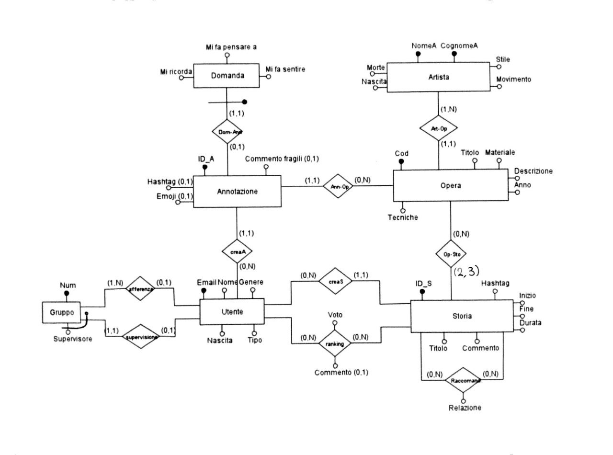
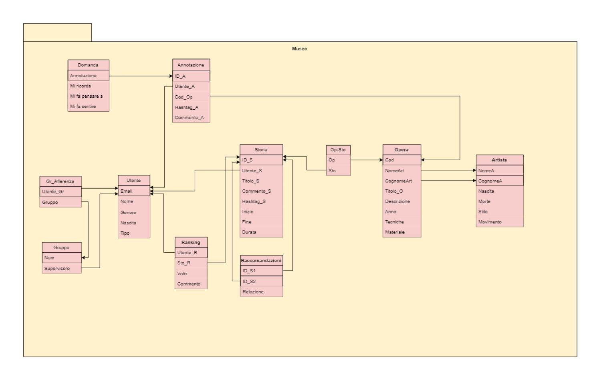

# Museum-DB
Database suitable for managing a museum's data with various possibilities for user interactions. Languages: SQL Database: PostgreSQL 
## Introduction
Various scripts to implement a relational Database, including the part of defining tables, populating and testing queries
## Description
The database is designed to manage a platform for a museum. Users who visit it have the ability to both comment on artworks and make stories about multiple artworks to give a personal opinion.
The various SQL scripts implement various pieces of the database:
* DDL: to define the various tables and integrity constraints
* DMLPOP: to populate various tables with fake data
* DMLUPD: to update various table rows
* SQL: to test the various features of the system by making different types of queries

Below are the various scheme describing the structure of the database.

### ER Scheme

### Relational Scheme

## Contributing
Contribution to budget-app is welcome! If you have an idea for a new feature or bug fix, please open an issue or a pull request.